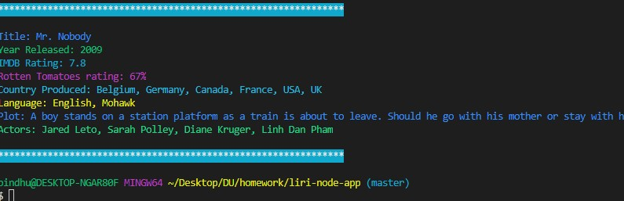

# LIRI Bot 
<h3>Overview</h3> 
LIRI is like iPhone's SIRI. However, while SIRI is a Speech Interpretation and Recognition Interface, LIRI is a Language Interpretation and Recognition Interface. LIRI will be a command line node app that takes in parameters and gives you back data.

Link to video of Application in Action

https://drive.google.com/file/d/1LdKEju-_oRYpAtqRKpJiMW9rcM5NwDCQ/view?usp=sharing

<h3>Function: Concert</h3>
if user will search the Bands in Town Artist Events API for an artist and render the following information about each event to the terminal:

<ul>
<li>Name of the venue</li>
<li>Venue location</li>
<li>Date of the Event</li>

</ul>

<!-- Format:  -->

