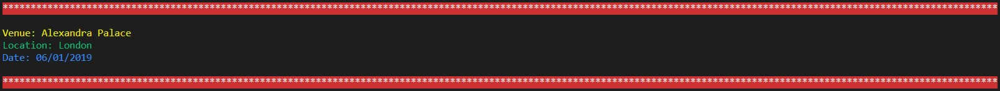
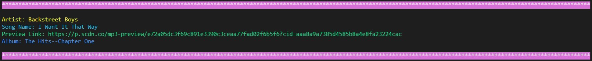

# LIRI Bot 
<h3>Overview</h3> 
LIRI is like iPhone's SIRI. However, while SIRI is a Speech Interpretation and Recognition Interface, LIRI is a Language Interpretation and Recognition Interface. LIRI will be a command line node app that takes in parameters and gives you back data.

<h3>This app can take in one of the following commands:</h3>
<ul>
<li>spotify-this-song</li>
<li>movie-this</li>
<li>concert-this</li>
<li>do-what-it-says</li>
</ul>

<h3>:musical_score:Song Function</h3>
<h6>Command: node liri.js spotify-this-song &lt;song name here&gt;</h6>
If user will search for Song, the following information will display in terminal/bash window

<ul>
<li>Artist(s)</li>
<li>The song's name</li>
<li>A preview link of the song from Spotify</li>
<li>The album that the song is from</li>
</ul>

<h3>:film_strip:Movie Function</h3>
<h6>Command: node liri.js movie-this  &lt;movie name here&gt;</h6>
If user will search for Movie, the following information will display in terminal/bash window
<ul>
<li>Title of the movie</li>
<li>Year the movie came out</li>
<li>IMDB Rating of the movie</li>
<li>Rotten Tomatoes Rating of the movie</li>
<li>Country where the movie was produced</li>
<li>Language of the movie</li>
<li>Plot of the movie</li>
<li>Actors in the movie</li>
</ul>

<h3>:loud_sound:Concert Function</h3>
<h6>Command: node liri.js concert-this  &lt;artist/band name here&gt;</h6>
If user will search for Concert, the following information will display in terminal/bash window
<ul>
<li>Name of the venue</li>
<li>Venue location</li>
<li>Date of the Event</li>
</ul>

<h3>:man_cartwheeling:Do What It Says Function</h3>
<h6>Command: node liri.js do-what-it-says</h6>
If user will search for Do What It Says, the following information will display in terminal/bash window
<ul>
<li>It should display "I Want it That Way," as follows the text in random.txt</li>
</ul>

